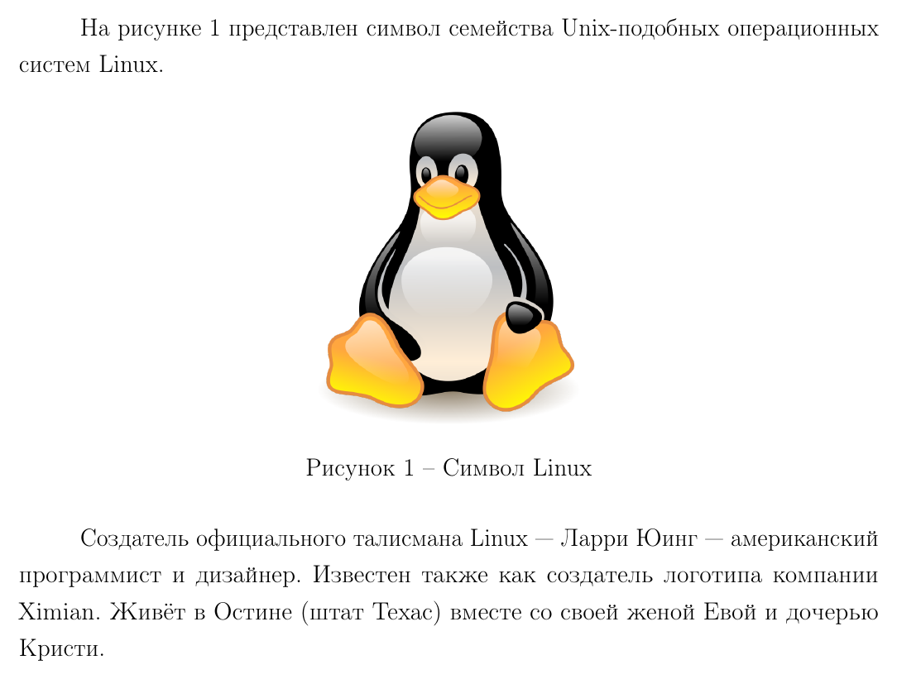
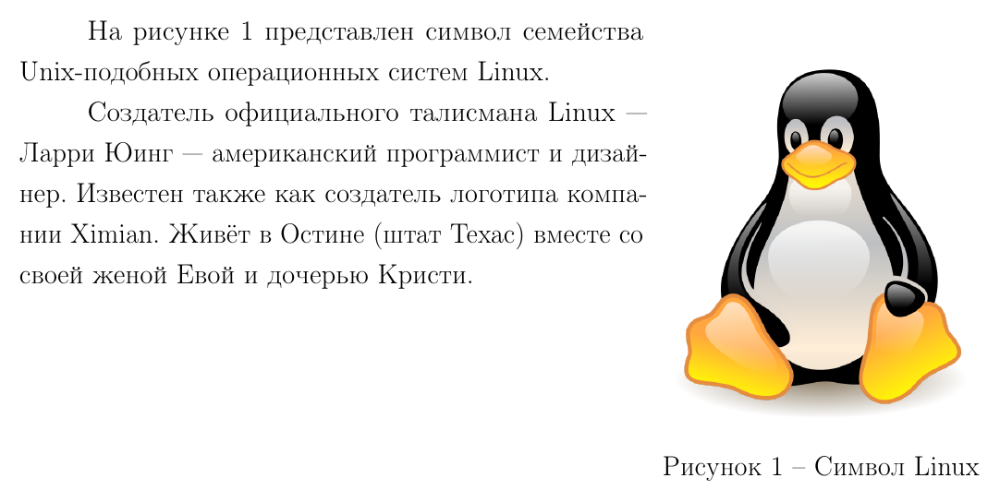
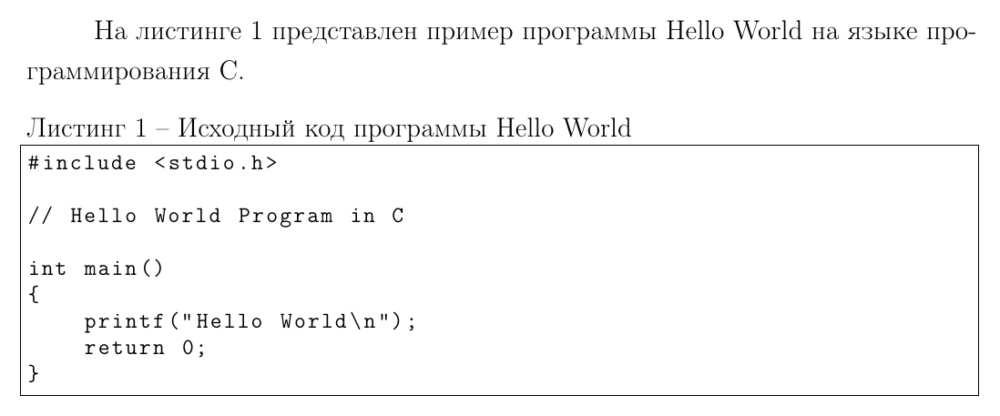

# Примеры использования команд

## Титульная страница

### Отчет
```latex
\makereporttitle
    {Информатика, искусственный интеллект и системы управления} % Название факультета
    {Программное обеспечение ЭВМ и информационные технологии} % Название кафедры
    {лабораторной работе №~1} % Название работы
    {Операционные системы} % Название курса (может быть пустым)
    {Обработчик прерывания от системного таймера} % Тема работы
    {} % Номер варианта (может быть пустым)
    {ИУ7-51Б} % Номер группы
    {Иванов~И.~И.} % ФИО студента
    {Петров~П.~П.} % ФИО преподавателя
```


### Расчетно-пояснительная записка к курсовой работе
```latex
\makecourseworktitle
    {Информатика, искусственный интеллект и системы управления} % Название факультета
    {Программное обеспечение ЭВМ и информационные технологии} % Название кафедры
    {Исследование распределения памяти в многопоточных приложениях Linux} % Тема работы
    {ИУ7-71Б} % Номер группы
    {Иванов~И.~И.} % ФИО студента
    {Петров~П.~П.} % ФИО научного руководителя
    {Сидоров~С.~С.} % ФИО консультанта (может быть пустым)
    {Кузнецов~К.~К.} % ФИО консультанта (может быть пустым)
```


### Отчет по научно-исследовательской работе
```latex
\makeresearchtitle
    {Информатика, искусственный интеллект и системы управления} % Название факультета
    {Программное обеспечение ЭВМ и информационные технологии} % Название кафедры
    {Исследование методов генерации исходного кода} % Тема работы
    {ИУ7-81Б} % Номер группы
    {Иванов~И.~И.} % ФИО студента
    {Петров~П.~П.} % ФИО научного руководителя
    {} % ФИО консультанта (может быть пустым)
    {} % ФИО консультанта (может быть пустым)
```


### Расчетно-пояснительная записка к выпускной квалификационной работе
```latex
\makethesistitle
    {Информатика, искусственный интеллект и системы управления} % Название факультета
    {Программное обеспечение ЭВМ и информационные технологии} % Название кафедры
    {Метод обнаружения спутников как точечных объектов на изображении} % Тема работы
    {ИУ7-81Б} % Номер группы
    {Иванов~И.~И.} % ФИО студента
    {Петров~П.~П.} % ФИО научного руководителя
    {Сидоров~С.~С.} % ФИО консультанта (может быть пустым)
    {} % ФИО консультанта (может быть пустым)
    {Кузнецов~К.~К.} % ФИО нормоконтролера
```


## Рисунок

Рисункам, добавленным следующими командами, присваивается метка `img:<имя файла без расширения>`.

### Без обтекание текста
```latex
На рисунке~\ref{img:tux} представлен символ семейства Unix-подобных операционных систем Linux.

\includeimage
    {tux} % Имя файла без расширения (файл должен быть расположен в директории inc/img/)
    {f} % Обтекание (без обтекания)
    {h} % Положение рисунка (см. figure из пакета float)
    {0.33\textwidth} % Ширина рисунка
    {Символ Linux} % Подпись рисунка

Cоздатель официального талисмана Linux --- Ларри Юинг --- американский программист и дизайнер.
Известен также как создатель логотипа компании Ximian.
Живёт в Остине (штат Техас) вместе со своей женой Евой и дочерью Кристи.
```


### С обтеканием текста
```latex
\includeimage
    {tux} % Имя файла без расширения (файл должен быть расположен в директории inc/img/)
    {w} % Обтекание (с обтеканием)
    {r} % Положение рисунка (см. wrapfigure из пакета wrapfig)
    {0.33\textwidth} % Ширина рисунка
    {Символ Linux} % Подпись рисунка

На рисунке~\ref{img:tux} представлен символ семейства Unix-подобных операционных систем Linux.

Cоздатель официального талисмана Linux --- Ларри Юинг --- американский программист и дизайнер.
Известен также как создатель логотипа компании Ximian.
Живёт в Остине (штат Техас) вместе со своей женой Евой и дочерью Кристи.
```


## Листинг

Листингам, добавленным следующими командами, присваивается метка `lst:<имя файла с расширением>`.

### Простой
```latex
На листинге~\ref{lst:main.c} представлен пример программы Hello World на языке программирования C.

\includelisting
    {main.c} % Имя файла с расширением (файл должен быть расположен в директории inc/lst)
    {Исходный код программы Hello World} % Подпись листинга
```


### C подсветкой синтаксиса и нумерацией строк

Обратите внимание, что добавление подсветки синтаксиса и нумерации строк приводит к ошибкам TestVKR.

```latex
На листинге~\ref{lst:main.c} представлен пример программы Hello World на языке программирования C.

\includelistingpretty
    {main.c} % Имя файла с расширением (файл должен быть расположен в директории inc/lst)
    {c} % Язык программирования (может быть пустым)
    {Исходный код программы Hello World} % Подпись листинга
```
