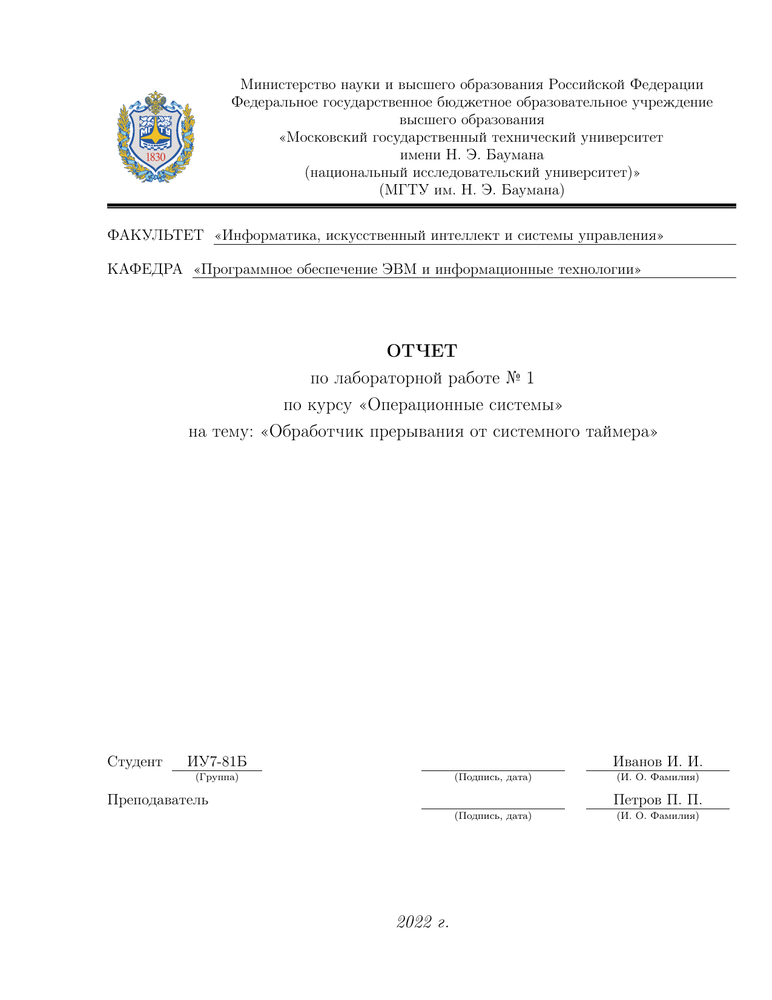
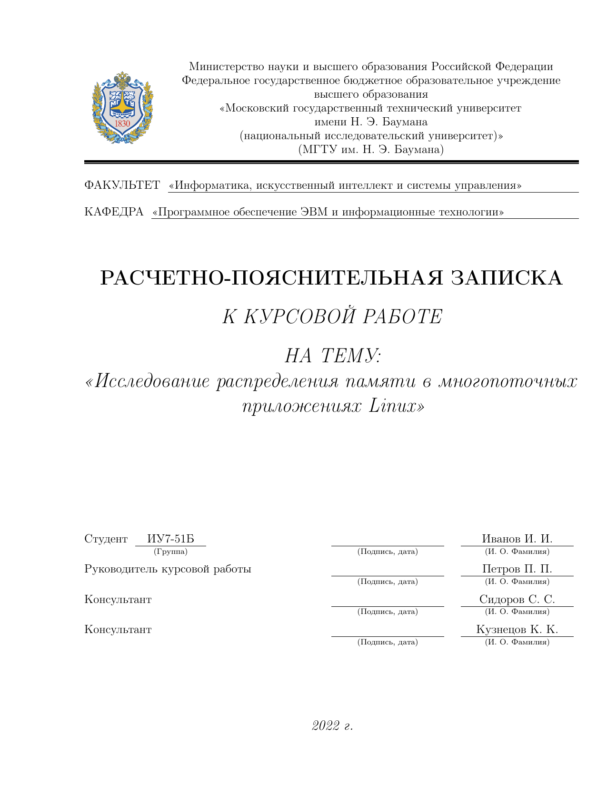
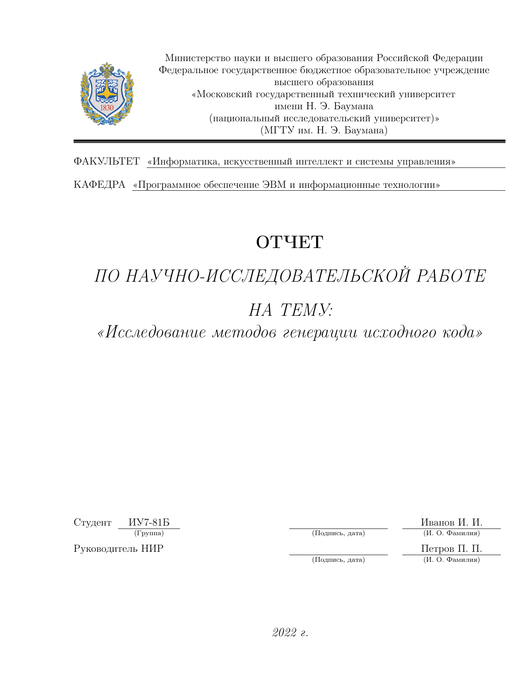
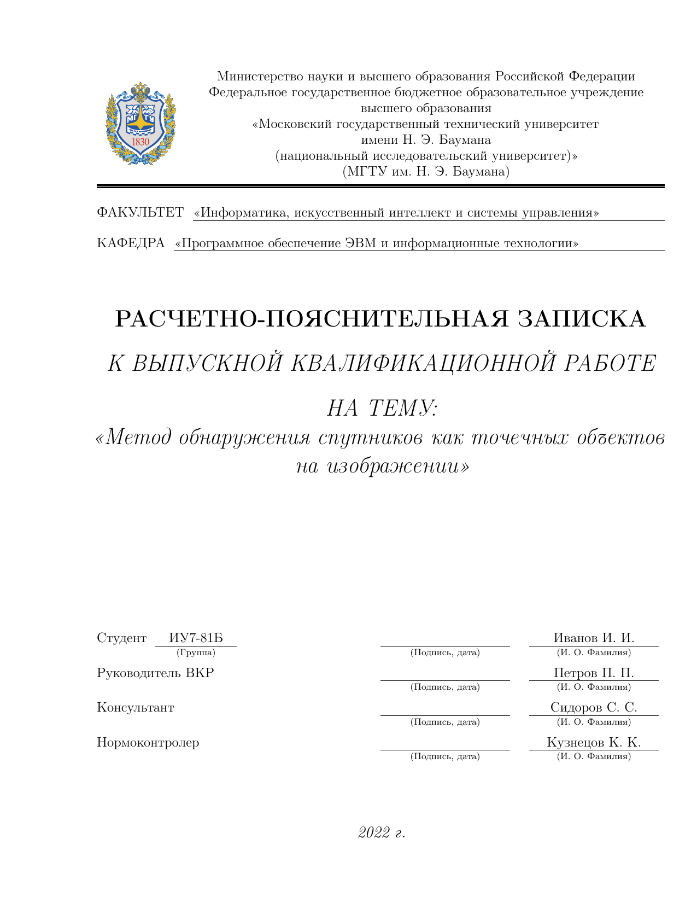

# Примеры команд

## Титульные страницы

### Отчет
```latex
\makereporttitle
    {Информатика, искусственный интеллект и системы управления} % Название факультета
    {Программное обеспечение ЭВМ и информационные технологии} % Название кафедры
    {лабораторной работе №~1} % Название работы
    {Операционные системы} % Название курса (может быть пустым)
    {Обработчик прерывания от системного таймера} % Тема работы
    {} % Номер варианта (может быть пустым)
    {ИУ7-51Б} % Номер группы
    {Иванов~И.~И.} % ФИО студента
    {Петров~П.~П.} % ФИО преподавателя
```


### Расчетно-пояснительная записка к курсовой работе
```latex
\makecourseworktitle
    {Информатика, искусственный интеллект и системы управления} % Название факультета
    {Программное обеспечение ЭВМ и информационные технологии} % Название кафедры
    {Исследование распределения памяти в многопоточных приложениях Linux} % Тема работы
    {ИУ7-71Б} % Номер группы
    {Иванов~И.~И.} % ФИО студента
    {Петров~П.~П.} % ФИО научного руководителя
    {Сидоров~С.~С.} % ФИО консультанта (может быть пустым)
    {Кузнецов~К.~К.} % ФИО консультанта (может быть пустым)
```


### Отчет по научно-исследовательской работе
```latex
\makeresearchtitle
    {Информатика, искусственный интеллект и системы управления} % Название факультета
    {Программное обеспечение ЭВМ и информационные технологии} % Название кафедры
    {Исследование методов генерации исходного кода} % Тема работы
    {ИУ7-81Б} % Номер группы
    {Иванов~И.~И.} % ФИО студента
    {Петров~П.~П.} % ФИО научного руководителя
    {} % ФИО консультанта (может быть пустым)
    {} % ФИО консультанта (может быть пустым)
```


### Расчетно-пояснительная записка к выпускной квалификационной работе
```latex
\makethesistitle
    {Информатика, искусственный интеллект и системы управления} % Название факультета
    {Программное обеспечение ЭВМ и информационные технологии} % Название кафедры
    {Метод обнаружения спутников как точечных объектов на изображении} % Тема работы
    {ИУ7-81Б} % Номер группы
    {Иванов~И.~И.} % ФИО студента
    {Петров~П.~П.} % ФИО научного руководителя
    {Сидоров~С.~С.} % ФИО консультанта (может быть пустым)
    {} % ФИО консультанта (может быть пустым)
    {Кузнецов~К.~К.} % ФИО нормоконтролера
```

